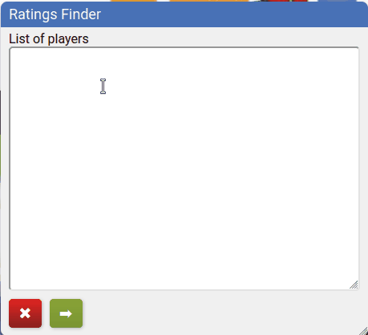

# bga-elo-ratings-finder
Enter a list of players, then find, display and export their Elo ratings, BGA-rank, number of played games and wins for Carcassonne on boardgamearena.com.

## ✨ Demo


## 📦 Setup
Create a new bookmark in your browser that points to this "address":
```
javascript:(function()%7B%2F**%0A%20*%20BGA%20Carcassonne%20Elo%20Ratings%0A%20*%0A%20*%20Display%20Carcassonne%20Elo%20ratings%20given%20a%20list%20of%20players%20or%20fixtures.%0A%20*%20cf.%20README.md%20or%20https%3A%2F%2Fgithub.com%2Fyzemaze%2Fbga-duel-box%0A%20*%2F%0A%0A(function()%20%7B%0A%22use%20strict%22%3B%0A%0Aconst%20REQUEST_INTERVAL%20%3D%20100%3B%20%2F%2F%20ms%0Aconst%20CACHE_DURATION%20%3D%207*24*60*60*1000%3B%20%2F%2F%207d%20in%20ms%0Aconst%20DATA_CACHE_DURATION%20%3D%202*60*60*1000%3B%20%2F%2F%202h%20in%20ms%0Aconst%20GAME_ID%20%3D%201%3B%0Aconst%20GAME_NAME%20%3D%20%22Carcassonne%22%3B%0Aconst%20SEPARATOR%20%3D%20%22%3B%22%3B%0A%0Alet%20style%20%3D%20document.createElement(%22style%22)%3B%0Astyle.innerHTML%20%3D%20%60%0A%09.drag-handle%20%7B%0A%09%09cursor%3A%20pointer%3B%0A%09%7D%0A%09.dragging%7B%0A%09%09cursor%3A%20move%20!important%3B%0A%09%7D%0A%09%23ratingsBox%20%7B%0A%09%09box-sizing%3A%20border-box%3B%0A%09%09display%3A%20grid%3B%0A%09%09grid-template-rows%3A%20max-content%201fr%3B%0A%09%09position%3A%20absolute%3B%0A%09%09left%3A%200px%3B%0A%09%09bottom%3A%200px%3B%0A%09%09width%3A%20max-content%3B%0A%09%09min-width%3A%20fit-content%3B%0A%09%09height%3A%20max-content%3B%0A%09%09min-height%3A%20110px%3B%0A%09%09background%3A%20%23f0f0f0%3B%0A%09%09box-shadow%3A%200%203px%208px%20rgba(0%2C0%2C0%2C.3)%3B%0A%09%09border-radius%3A%208px%3B%0A%09%09z-index%3A%2010000%3B%0A%09%09resize%3A%20both%3B%0A%09%09overflow%3A%20hidden%3B%0A%09%7D%0A%09%23ratingsBox%20*%20%7B%0A%09%09box-sizing%3A%20border-box%3B%0A%09%7D%0A%09%23ratingsBox%20.duel%20a%20%7B%0A%09%09color%3A%20rgb(72%2C%20113%2C%20182)%3B%0A%09%09text-decoration%3A%20none%3B%0A%09%7D%0A%09%23ratingsBox%20h2%20%7B%0A%09%09font-weight%3A%20normal%3B%0A%09%09margin%3A%200%3B%0A%09%7D%0A%09%23ratingsBox%20.bga-link%20%7B%0A%09%09font-weight%3A%20normal%3B%0A%09%7D%0A%09%23ratingsBox%20h2.dfComment%20%7B%0A%09%09font-weight%3A%20bold%3B%0A%09%7D%0A%09%23ratingsBox%20%23boxHead%20%7B%0A%09%09background%3A%20%234871b6%3B%0A%09%09color%3A%20%23fff%3B%0A%09%09padding%3A%205px%2010px%3B%0A%09%09user-select%3A%20none%3B%0A%09%7D%0A%09%23ratingsBox%20%23boxBody%20%7B%0A%09%09display%3A%20grid%3B%0A%09%09grid-template-rows%3A%201fr%20max-content%3B%0A%09%09grid-gap%3A%2010px%3B%0A%09%09overflow%3A%20auto%3B%0A%09%09padding%3A%205px%2010px%2010px%2010px%3B%0A%09%7D%0A%09%23ratingsBox%20%23inputForm%20%7B%0A%09%09display%3A%20grid%3B%0A%09%09grid-template-rows%3A%20max-content%201fr%3B%0A%09%7D%0A%09%23ratingsBox%20%23inputForm%20input%20%7B%0A%09%09width%3A%20fit-content%3B%0A%09%09border-radius%3A%205px%3B%0A%09%7D%0A%09%23boxBody.ratingsView%20%23inputForm%20%7B%0A%09%09display%3A%20none%3B%0A%09%7D%0A%09%23configText%2C%20%23configTextLabel%20%7B%0A%09%09grid-column%3A%20span%202%3B%0A%09%7D%0A%09%23configText%20%7B%0A%09%09min-height%3A%20100px%3B%0A%09%09height%3A%20100%25%3B%0A%09%09width%3A%20100%25%3B%0A%09%09border-radius%3A%205px%3B%0A%09%7D%0A%09%23ratingsBox%20%23buttonDiv%20%7B%0A%09%09display%3A%20grid%3B%0A%09%09grid-template-columns%3A%20repeat(3%2C%20max-content)%3B%0A%09%09grid-gap%3A%2010px%3B%0A%09%09font-size%3A%201em%3B%0A%09%7D%0A%09%23ratingsBox%20%23buttonDiv%20.bgabutton%20%7B%0A%09%09margin%3A%200%3B%0A%09%09height%3A%20fit-content%3B%0A%09%09width%3A%20fit-content%3B%0A%09%7D%0A%09%23rfFindButton%2C%20%23rfCloseButton%20%7B%0A%09%09display%3A%20block%3B%0A%09%7D%0A%09%23rfBackButton%2C%20%23rfCopyButton%20%7B%0A%09%09display%3A%20none%3B%0A%09%7D%0A%09.ratingsView%20%23rfBackButton%2C%20.ratingsView%20%23rfCopyButton%2C%20.ratingsView%20%23ratingsTable%20%7B%0A%09%09display%3A%20block%3B%0A%09%7D%0A%09.ratingsView%20%23rfFindButton%2C%20.ratingsView%20%23rfCloseButton%20%7B%0A%09%09display%3A%20none%3B%0A%09%7D%0A%09%23ratingsTable%20%7B%0A%09%09display%3A%20none%3B%0A%09%09border-spacing%3A%2010px%202px%3B%0A%09%09border-collapse%3A%20separate%3B%0A%09%7D%0A%09%23ratingsTable%20th%20%7B%0A%09%09font-weight%3A%20bold%3B%0A%09%09text-align%3A%20center%3B%0A%09%7D%0A%09%23ratingsTable%20td.right%20%7B%0A%09%09text-align%3A%20right%3B%0A%09%7D%0A%09%23ratingsTable.matches%20tr%3Anth-child(even)%3Anot(%3Alast-child)%20td%20%7B%0A%09%09border-bottom%3A%201px%20dashed%20black%3B%0A%09%7D%0A%20%60%3B%0Adocument.head.appendChild(style)%3B%0A%0AcreateUi()%3B%0A%0A%2F**%0A%20*%20Create%20ui%20for%20user%20interaction.%0A%20*%0A%20*%2F%0Afunction%20createUi()%20%7B%0A%09const%20boxId%20%3D%20%22ratingsBox%22%3B%0A%09let%20ratingsBox%20%3D%20document.getElementById(boxId)%3B%0A%09if%20(ratingsBox)%20%7B%0A%09%09ratingsBox.style.display%20%3D%20%22grid%22%3B%0A%09%09return%3B%0A%09%7D%0A%0A%09ratingsBox%20%3D%20document.createElement(%22div%22)%3B%0A%09ratingsBox.id%20%3D%20boxId%3B%0A%09ratingsBox.setAttribute(%22data-draggable%22%2C%20true)%3B%0A%09ratingsBox.setAttribute(%22data-resizable%22%2C%20true)%3B%0A%09let%20boxHead%20%3D%20document.createElement(%22h2%22)%3B%0A%09boxHead.id%20%3D%20%22boxHead%22%3B%0A%09boxHead.setAttribute(%22data-drag-handle%22%2C%20true)%3B%0A%09boxHead.innerText%20%3D%20%22Ratings%20Finder%22%3B%0A%09boxHead.classList.add(%22drag-handle%22)%3B%0A%09let%20boxBody%20%3D%20document.createElement(%22div%22)%3B%0A%09boxBody.id%20%3D%20%22boxBody%22%3B%0A%09ratingsBox.appendChild(boxHead)%3B%0A%09ratingsBox.appendChild(boxBody)%3B%0A%0A%09const%20inputForm%20%3D%20document.createElement(%22form%22)%3B%0A%09inputForm.id%20%3D%20%22inputForm%22%3B%0A%09const%20configText%20%3D%20document.createElement(%22textArea%22)%3B%0A%09configText.id%20%3D%20%22configText%22%3B%0A%09const%20configTextLabel%20%3D%20document.createElement(%22label%22)%3B%0A%09configTextLabel.id%20%3D%20%22configTextLabel%22%3B%0A%09configTextLabel.htmlFor%20%3D%20%22configText%22%3B%0A%09configTextLabel.textContent%20%3D%20%22List%20of%20players%22%3B%0A%0A%09inputForm.appendChild(configTextLabel)%3B%0A%09inputForm.appendChild(configText)%3B%0A%0A%09const%20ratingsTable%20%3D%20document.createElement(%22table%22)%3B%0A%09ratingsTable.id%20%3D%20%22ratingsTable%22%3B%0A%0A%09const%20buttonDiv%20%3D%20document.createElement(%22div%22)%3B%0A%09buttonDiv.id%20%3D%20%22buttonDiv%22%3B%0A%09const%20findButton%20%3D%20document.createElement(%22a%22)%3B%0A%09findButton.id%20%3D%20%22rfFindButton%22%3B%0A%09findButton.classList%20%3D%20%22bgabutton%20bgabutton_green%22%3B%0A%09findButton.innerText%20%3D%20%22Get%20ratings%22%3B%0A%09const%20backButton%20%3D%20document.createElement(%22a%22)%3B%0A%09backButton.id%20%3D%20%22rfBackButton%22%3B%0A%09backButton.classList%20%3D%20%22bgabutton%20bgabutton_red%22%3B%0A%09backButton.innerText%20%3D%20%22Back%22%3B%0A%09const%20closeButton%20%3D%20document.createElement(%22a%22)%3B%0A%09closeButton.id%20%3D%20%22rfCloseButton%22%3B%0A%09closeButton.classList%20%3D%20%22bgabutton%20bgabutton_red%22%3B%0A%09closeButton.innerText%20%3D%20%22Close%22%3B%0A%09const%20copyButton%20%3D%20document.createElement(%22a%22)%3B%0A%09copyButton.id%20%3D%20%22rfCopyButton%22%3B%0A%09copyButton.classList%20%3D%20%22bgabutton%20bgabutton_blue%22%3B%0A%09copyButton.innerText%20%3D%20%22Copy%22%3B%0A%09buttonDiv.appendChild(closeButton)%3B%0A%09buttonDiv.appendChild(findButton)%3B%0A%09buttonDiv.appendChild(backButton)%3B%0A%09buttonDiv.appendChild(copyButton)%3B%0A%0A%09boxBody.appendChild(inputForm)%3B%0A%09boxBody.appendChild(ratingsTable)%3B%0A%09boxBody.appendChild(buttonDiv)%3B%0A%0A%09document.body.appendChild(ratingsBox)%3B%0A%09applyBoxLayout(ratingsBox)%3B%0A%0A%09let%20timeout%3B%0A%09const%20resizeObserver%20%3D%20new%20ResizeObserver(entries%20%3D%3E%20%7B%0A%09%09clearTimeout(timeout)%3B%0A%09%09timeout%20%3D%20setTimeout(()%20%3D%3E%20%7B%0A%09%09%09requestAnimationFrame(()%20%3D%3E%20%7B%0A%09%09%09%09for%20(const%20entry%20of%20entries)%20%7B%0A%09%09%09%09%09saveBoxLayoutToLocalStorage(entry.target)%3B%0A%09%09%09%09%7D%0A%09%09%09%7D)%3B%0A%09%09%7D%2C%201000)%3B%0A%09%7D)%3B%0A%09resizeObserver.observe(ratingsBox)%3B%0A%0A%09configText.addEventListener(%22paste%22%2C%20(event)%20%3D%3E%20%7B%0A%09%09%2F%2F%20Just%20check%20if%20pasted%20text%20is%20in%20the%20form%20of%3A%0A%09%09%2F%2F%0A%09%09%2F%2F%20%20%20player1%0A%09%09%2F%2F%20%20%20vs%0A%09%09%2F%2F%20%20%20player2%0A%09%09%2F%2F%20%20%20player3%0A%09%09%2F%2F%20%20%20vs%0A%09%09%2F%2F%20%20%20player4%0A%09%09%2F%2F%20%20%20...%0A%09%09%2F%2F%0A%09%09%2F%2F%20and%20format%20it.%0A%09%09const%20pastedData%20%3D%20(event.clipboardData%20%7C%7C%20window.clipboardData).getData(%22text%22)%3B%0A%09%09event.preventDefault()%3B%0A%0A%09%09%2F%2F%20transform%20non-empty%20lines%20separated%20by%20a%20%22vs%22-line%20into%20one-liners%0A%09%09const%20regex%20%3D%20%2F(%5B%5E%5Cr%5Cn%5D%2B)%5Cs*%5Cn%5Cs*vs%5Cs*%5Cn%5Cs*(%5B%5E%5Cr%5Cn%5D%2B)%2Fg%3B%0A%09%09let%20matches%20%3D%20%5B%5D%3B%0A%09%09let%20match%3B%0A%09%09while%20((match%20%3D%20regex.exec(pastedData))%20!%3D%3D%20null)%20%7B%0A%09%09%09matches.push(%60%24%7Bmatch%5B1%5D.trim()%7D%20vs%20%24%7Bmatch%5B2%5D.trim()%7D%60)%3B%0A%09%09%7D%0A%09%09const%20transformedText%20%3D%20matches.length%20%3E%200%20%3F%20matches.join(%22%5Cn%22)%20%3A%20pastedData%3B%0A%0A%09%09%2F%2F%20Get%20the%20current%20cursor%20position%20or%20selection%0A%09%09const%20start%20%3D%20configText.selectionStart%3B%0A%09%09const%20end%20%3D%20configText.selectionEnd%3B%0A%09%09%2F%2F%20Insert%20the%20transformed%20text%20at%20the%20cursor%20position%0A%09%09configText.value%20%3D%20configText.value.slice(0%2C%20start)%20%2B%20transformedText%20%2B%20configText.value.slice(end)%3B%0A%09%09%2F%2F%20Move%20the%20cursor%20to%20the%20end%20of%20the%20inserted%20text%0A%09%09configText.selectionStart%20%3D%20configText.selectionEnd%20%3D%20start%20%2B%20transformedText.length%3B%0A%09%7D)%3B%0A%0A%09findButton.onclick%20%3D%20async%20function%20()%20%7B%0A%09%09configText.disabled%20%3D%20true%3B%0A%09%09findButton.disabled%20%3D%20true%3B%0A%09%09saveDataToLocalStorage()%3B%0A%09%09document.getElementById(%22boxBody%22).classList.toggle(%22ratingsView%22)%3B%0A%09%09await%20printPlayerStats()%3B%0A%09%09findButton.disabled%20%3D%20false%3B%0A%09%7D%3B%0A%0A%09backButton.onclick%20%3D%20function%20()%20%7B%0A%09%09document.getElementById(%22boxBody%22).classList.toggle(%22ratingsView%22)%3B%0A%09%09ratingsTable.innerHTML%20%3D%20%22%22%3B%0A%09%09configText.disabled%20%3D%20false%3B%0A%09%7D%3B%0A%0A%09closeButton.onclick%20%3D%20function%20()%20%7B%0A%09%09document.body.removeChild(ratingsBox)%3B%0A%09%7D%0A%0A%09copyButton.onclick%20%3D%20function%20()%20%7B%0A%09%09const%20exportText%20%3D%20document.getElementById(%22ratingsTable%22).innerText%3B%0A%09%09navigator.clipboard.writeText(exportText)%3B%0A%09%7D%0A%0A%09retrieveDataFromLocalStorage()%3B%0A%7D%0A%0A%2F**%0A%20*%20Returns%20a%20player%20id%20given%20its%20username.%0A%20*%0A%20*%2F%0Afunction%20getPlayerId(name)%20%7B%0A%09const%20currentTime%20%3D%20new%20Date().getTime()%3B%0A%09const%20cacheKey%20%3D%20%60playerId-%24%7Bname.toLowerCase()%7D%60%3B%0A%09const%20cached%20%3D%20localStorage.getItem(cacheKey)%3B%0A%09if%20(cached)%20%7B%0A%09%09const%20data%20%3D%20JSON.parse(cached)%3B%0A%09%09if%20(currentTime%20-%20data.timestamp%20%3C%20CACHE_DURATION)%20%7B%0A%09%09%09console.debug(%60Using%20cached%20id%20%24%7Bdata.id%7D%20for%20%24%7Bname%7D%60)%3B%0A%09%09%09return%20data.id%3B%0A%09%09%7D%0A%09%7D%0A%0A%09try%20%7B%0A%09%09const%20response%20%3D%20dojo.xhrGet(%7B%0A%09%09%09url%3A%20%22https%3A%2F%2Fboardgamearena.com%2Fplayer%2Fplayer%2Ffindplayer.html%22%2C%0A%09%09%09content%3A%20%7B%20q%3A%20name%2C%20start%3A%200%2C%20count%3A%20Infinity%20%7D%2C%0A%09%09%09sync%3A%20true%2C%0A%09%09%09handleAs%3A%20%22json%22%0A%09%09%7D)%3B%0A%0A%09%09for%20(const%20currentUser%20of%20response.results%5B0%5D.items)%20%7B%0A%09%09%09if%20(currentUser.q.toLowerCase()%20%3D%3D%3D%20name.toLowerCase())%20%7B%0A%09%09%09%09console.debug(%60Found%20id%20%24%7BcurrentUser.id%7D%20for%20%24%7Bname%7D%60)%3B%0A%09%09%09%09localStorage.setItem(cacheKey%2C%20JSON.stringify(%7B%20id%3A%20currentUser.id%2C%20timestamp%3A%20currentTime%20%7D))%3B%0A%09%09%09%09return%20currentUser.id%3B%0A%09%09%09%7D%0A%09%09%7D%0A%09%09console.error(%60Could%20not%20find%20user%20%24%7Bname%7D%60)%3B%0A%09%09throw%20%22Player%20not%20found%22%3B%0A%09%7D%0A%09catch%20(error)%20%7B%0A%09%09console.error(%60Could%20not%20find%20user%20%24%7Bname%7D%60)%3B%0A%09%09throw%20error%3B%0A%09%7D%0A%7D%0A%0A%2F**%0A%20*%20generates%20CSV%20from%20user%20data%0A%20*%0A%20*%2F%0Afunction%20parsePlayerStats(player_page)%20%7B%0A%09let%20player%20%3D%20player_page.querySelector(%22%23player_name%22).innerText.trim()%3B%0A%09%2F*%20stats%20per%20game%20*%2F%0A%09let%20gameDivs%20%3D%20player_page.getElementsByClassName(%22palmares_game%22)%3B%0A%09for%20(let%20i%20%3D%200%3B%20i%20%3C%20gameDivs.length%3B%20i%2B%2B)%20%7B%0A%09%09let%20game%20%3D%20gameDivs%5Bi%5D.getElementsByClassName(%22gamename%22)%5B0%5D.innerText%3B%0A%09%09if%20(game%20%3D%3D%20GAME_NAME)%20%7B%0A%09%09%09var%20rank%20%3D%20%22%22%3B%0A%09%09%09let%20rankStr%20%3D%20gameDivs%5Bi%5D.getElementsByClassName(%22gamerank_no%22)%5B0%5D%3B%0A%09%09%09if%20(rankStr)%20rank%20%3D%20rankStr.innerText.match(%2F(%5Cd%2B)%3F%2F)%5B0%5D%3B%0A%09%09%09let%20details%20%3D%20gameDivs%5Bi%5D.getElementsByClassName(%22palmares_details%22)%5B0%5D.innerText%3B%0A%09%09%09details%20%3D%20details.split(%22%25%22)%5B0%5D%3B%0A%09%09%09let%20arr%20%3D%20details.match(%2F(%5Cd%2B%5B%5Cs0-9%5D*)%2Fg)%3B%0A%09%09%09var%20matches%20%3D%20Number(arr%5B0%5D.replace(%2F%5Cs%2Fg%2C%20''))%3B%0A%09%09%09if%20(arr.length%20%3D%3D%203)%20%7B%0A%09%09%09%09var%20won%20%3D%20Number(arr%5B1%5D.replace(%2F%5Cs%2Fg%2C%20''))%3B%0A%09%09%09%7D%20else%20%7B%0A%09%09%09%09matches%20%2B%3D%20Number(arr%5B1%5D.replace(%2F%5Cs%2Fg%2C%20''))%3B%0A%09%09%09%09var%20won%20%3D%20Number(arr%5B2%5D.replace(%2F%5Cs%2Fg%2C%20''))%3B%0A%09%09%09%7D%0A%09%09%09var%20elo%20%3D%20gameDivs%5Bi%5D.getElementsByClassName(%22gamerank_value%22)%5B0%5D.innerText%3B%0A%09%09%09i%20%3D%20gameDivs.length%3B%0A%09%09%7D%0A%09%7D%0A%09return%20%5Bplayer%2C%20elo%2C%20rank%2C%20matches%2C%20won%2C%20(won%20%2F%20matches%20*%20100).toFixed(2)%5D%3B%0A%7D%0A%0A%2F*%20fetches%20and%20prints%20players'%20stats%20*%2F%0Afunction%20printPlayerStats()%20%7B%0A%09const%20ratingsTable%20%3D%20document.getElementById(%22ratingsTable%22)%3B%0A%09let%20loading%20%3D%20async%20()%20%3D%3E%20%7B%0A%09%09const%20parser%20%3D%20new%20DOMParser()%3B%0A%0A%09%09let%20configText%20%3D%20document.getElementById(%22configText%22).value.replace(%2F%5E%5Cs*%5B%5Cr%5Cn%5D%2Fgm%2C%20%22%22)%3B%0A%09%09const%20lines%20%3D%20configText.split(%2F%5Cr%5Cn%7C%5Cr%7C%5Cn%2F).length%3B%0A%09%09let%20players%20%3D%20configText.trim().split(%2F%5Cd%2B%5C.%5Cs%2B%7C%20vs%20%7C%20-%20%7C%20%E2%80%93%20%7C%5Cn%2Fg)%3B%0A%09%09if%20(players.length%20%3E%20lines)%20%7B%0A%09%09%09ratingsTable.classList.add(%22matches%22)%3B%0A%09%09%7D%0A%09%09players%20%3D%20players.filter(e%20%3D%3E%20e)%3B%0A%09%09let%20playerValues%3B%0A%0A%09%09const%20thead%20%3D%20ratingsTable.createTHead()%3B%0A%09%09const%20hrow%20%3D%20thead.insertRow()%3B%0A%09%09%5B%22Name%22%2C%20%22Elo%22%2C%20%22Rank%22%2C%20%22Matches%22%2C%20%22Won%22%2C%20%22%25%22%5D.forEach(h%20%3D%3E%20%7B%0A%09%09%09hrow.insertCell().outerHTML%20%3D%20%60%3Cth%3E%24%7Bh%7D%3C%2Fth%3E%60%3B%0A%09%09%7D)%3B%0A%09%09const%20tbody%20%3D%20ratingsTable.createTBody()%3B%0A%0A%09%09for%20(let%20i%20%3D%200%3B%20i%20%3C%20players.length%3B%20%2B%2Bi)%20%7B%0A%09%09%09await%20sleep(REQUEST_INTERVAL)%3B%0A%09%09%09let%20row%20%3D%20tbody.insertRow()%3B%0A%09%09%09const%20response%20%3D%20await%20fetch('https%3A%2F%2Fboardgamearena.com%2Fplayer%3Fname%3D'%20%2B%20players%5Bi%5D)%3B%0A%09%09%09const%20html_str%20%3D%20await%20response.text()%3B%0A%09%09%09const%20doc%20%3D%20parser.parseFromString(html_str%2C%20%22text%2Fhtml%22)%3B%0A%09%09%09try%20%7B%0A%09%09%09%09playerValues%20%3D%20parsePlayerStats(doc)%3B%0A%09%09%09%09for%20(let%20j%20%3D%200%3B%20j%20%3C%20playerValues.length%3B%20%2B%2Bj)%20%7B%0A%09%09%09%09%09let%20cell%20%3D%20row.insertCell(j)%0A%09%09%09%09%09cell.innerHTML%20%3D%20playerValues%5Bj%5D%3B%0A%09%09%09%09%09if%20(j%20%3E%200)%20%7B%20cell.classList%20%3D%20%22right%22%3B%20%7D%3B%0A%09%09%09%09%7D%0A%09%09%09%7D%20catch%20(err)%20%7B%0A%09%09%09%09row.insertCell(0).innerHTML%20%3D%20players%5Bi%5D%3B%0A%09%09%09%09row.insertCell(1).innerHTML%20%3D%20%22n%2Fa%22%3B%0A%09%09%09%09console.error(players%5Bi%5D%20%2B%20%22%5Cn%22%20%2B%20err)%3B%0A%09%09%09%09console.error(doc)%3B%0A%09%09%09%7D%0A%09%09%7D%0A%09%7D%3B%0A%09loading()%3B%0A%7D%0A%0Aasync%20function%20sleep(ms)%20%7B%0A%09await%20new%20Promise(resolve%20%3D%3E%20setTimeout(resolve%2C%20ms))%3B%0A%7D%0A%0AdragElement(document.getElementById(%22ratingsBox%22))%3B%0A%0Afunction%20dragElement(el)%20%7B%0A%09var%20pos1%20%3D%200%2C%20pos2%20%3D%200%2C%20pos3%20%3D%200%2C%20pos4%20%3D%200%3B%0A%09document.getElementById(%22boxHead%22).onmousedown%20%3D%20dragMouseDown%3B%0A%0A%09const%20onmouseupBackup%20%3D%20document.onmouseup%3B%0A%09const%20onmousemoveBackup%20%3D%20document.onmousemove%3B%0A%0A%09function%20dragMouseDown(e)%20%7B%0A%09%09e%20%3D%20e%20%7C%7C%20window.event%3B%0A%09%09e.preventDefault()%3B%0A%09%09pos3%20%3D%20e.clientX%3B%0A%09%09pos4%20%3D%20e.clientY%3B%0A%09%09document.onmouseup%20%3D%20closeDragElement%3B%0A%09%09document.onmousemove%20%3D%20elementDrag%3B%0A%09%7D%0A%0A%09function%20elementDrag(e)%20%7B%0A%09%09e%20%3D%20e%20%7C%7C%20window.event%3B%0A%09%09e.preventDefault()%3B%0A%09%09pos1%20%3D%20pos3%20-%20e.clientX%3B%0A%09%09pos2%20%3D%20pos4%20-%20e.clientY%3B%0A%09%09pos3%20%3D%20e.clientX%3B%0A%09%09pos4%20%3D%20e.clientY%3B%0A%09%09el.style.top%20%3D%20(el.offsetTop%20-%20pos2)%20%2B%20%22px%22%3B%0A%09%09el.style.left%20%3D%20(el.offsetLeft%20-%20pos1)%20%2B%20%22px%22%3B%0A%09%7D%0A%0A%09function%20closeDragElement()%20%7B%0A%09%09document.onmouseup%20%3D%20onmouseupBackup%3B%0A%09%09document.onmousemove%20%3D%20onmousemoveBackup%3B%0A%09%09saveBoxLayoutToLocalStorage()%3B%0A%09%7D%0A%7D%0A%0Afunction%20saveDataToLocalStorage()%20%7B%0A%09let%20rfData%20%3D%20new%20Map()%3B%0A%09rfData.configText%20%3D%20document.getElementById(%22configText%22).value%3B%0A%09rfData.lastSaved%20%3D%20Date.now()%3B%0A%09localStorage.setItem(%22rfData%22%2C%20JSON.stringify(rfData))%3B%0A%09console.debug(%22Data%20saved%20to%20localStorage%22)%3B%0A%7D%0A%0Afunction%20retrieveDataFromLocalStorage()%20%7B%0A%09let%20rfData%20%3D%20%22%22%3B%0A%09if%20(localStorage.rfData)%20%7B%0A%09%09rfData%20%3D%20JSON.parse(localStorage.rfData)%3B%0A%09%09const%20configText%20%3D%20rfData.configText%20%3F%3F%20%22%22%3B%0A%09%09document.getElementById(%22configText%22).value%20%3D%20configText%3B%0A%09%09console.debug(%22Data%20retrieved%20from%20localStorage%22)%3B%0A%09%09const%20lastSaved%20%3D%20rfData.lastSaved%3B%0A%09%09if%20(Date.now()%20-%20lastSaved%20%3C%20DATA_CACHE_DURATION)%20%7B%0A%09%09%09console.debug(%22Reloading%20retrieved%20data%22)%0A%09%09%09document.getElementById(%22rfFindButton%22).click()%3B%0A%09%09%09applyBoxLayout()%3B%0A%09%09%7D%0A%09%7D%20else%20%7B%0A%09%09console.debug(%22Could%20not%20retrieve%20data%20from%20localStorage%22)%3B%0A%09%7D%0A%7D%0A%0Afunction%20saveBoxLayoutToLocalStorage(box)%20%7B%0A%09const%20el%20%3D%20box%20%3F%3F%20document.getElementById(%22ratingsBox%22)%3B%0A%09let%20rfBoxAttrs%20%3D%20%7B%0A%09%09height%3A%20el.style.height%2C%0A%09%09width%3A%20el.style.width%2C%0A%09%09top%3A%20el.style.top%2C%0A%09%09left%3A%20el.style.left%0A%09%7D%3B%0A%09localStorage.setItem(%22rfBoxAttrs%22%2C%20JSON.stringify(rfBoxAttrs))%3B%0A%09console.debug(%22Layout%20saved%20to%20localStorage%22)%3B%0A%7D%0A%0Afunction%20applyBoxLayout(box)%20%7B%0A%09const%20el%20%3D%20box%20%3F%3F%20document.getElementById(%22ratingsBox%22)%3B%0A%09if%20(localStorage.rfBoxAttrs)%20%7B%0A%09%09const%20rfBoxAttrs%20%3D%20JSON.parse(localStorage.rfBoxAttrs)%3B%0A%09%09el.style.height%20%3D%20rfBoxAttrs.height%3B%0A%09%09el.style.width%20%3D%20rfBoxAttrs.width%3B%0A%09%09el.style.top%20%3D%20rfBoxAttrs.top%3B%0A%09%09el.style.left%20%3D%20rfBoxAttrs.left%3B%0A%09%7D%0A%09saveBoxLayoutToLocalStorage(el)%3B%0A%7D%0A%0A%7D)()%3B%7D)()%3B
```
## 🚀 Usage

1. Go to https://boardgamearena.com and log in.
2. Click on the bookmark you created.
3. Enter or paste a list of usernames or duels.
4. Click green ➡ button and let the script to gather and display data (abort with ⬅).
5. Drag (header only) and resize the box to fit your needs.
6. Hit 📋 button to copy the results to your clipboard.

### 👩‍💻 Duels syntax
` - ` (minus sign), ` – ` (en dash) or ` vs ` [with leading and trailing space!] are valid separators between usernames:
```
Player A - Player B
Player A vs Player B
```
If you paste text with this syntax …
```
Player A
vs
Player B
```
… it will be converted to `Player A vs Player B`.

Leading ordinals like "x." are ignored. [`1. foo vs bar` will become `foo vs bar`.]

Duels are separated by dotted lines on the results view.

### 💾 Backup & restore data & window layout
To spare you the hassle of setting things up again and again the script saves the layout and size of the window to the localStorage of your browser. This is triggered every time you resize or drag the window.
If you start the script within 2 hours after your last search the last configured list of players or duels will be loaded automatically and results will be displayed asap. If you don’t need this just hit the red ⬅ button to abort.

### ⚠️ Do not spam BGA
Please use this tool with caution so BGA doesn’t throttle your connection.

## 🆘 Questions, feedback, suggestions etc.
Feel free to open an issue or a discussion over here or contact me on BGA.

Hat tip to [oliverosz](https://github.com/oliverosz/bga-export-stats) for the great work! :-)
